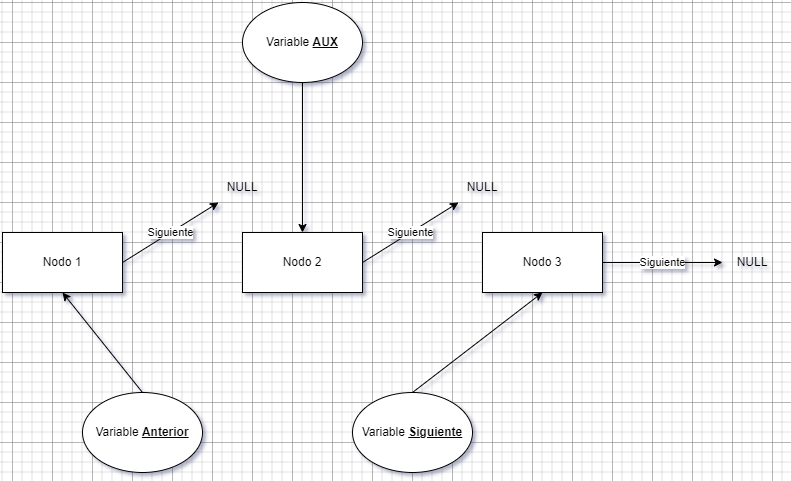

# Manejo de Lista Enlazada Simple

## Descripción

Este proyecto fue creado para servir de ejemplo de cómo implementar una **lista enlazada simple**.

## Vista Previa Del Programa


## Diagrama de la Lista


### Inicio

```c
int main()
{
    Lista *lista = NULL;
    ...
}
```

### Nodo

```c
typedef struct SLista
{
    Datos datos;
    struct SLista *siguiente;
} Lista;
```

### Datos

```c
typedef struct SDatos
{
    char nombre[20];
    int edad;
} Datos;
```

### Agregar Nodo

```c
Lista *nueva_lista = (Lista *)malloc(sizeof(Lista));
if (nueva_lista != NULL)
{
    strcpy(nueva_lista->datos.nombre, nombre);
    nueva_lista->datos.edad = edad;
    nueva_lista->siguiente = NULL;
    lista_insertar(&*lista, nueva_lista);
}
else
{
    printf(">> No hay espacio suficiente en memoria <<\n");
}
```

### Borrar Nodo

```c
Lista *aux = lista_seleccionar(*lista, nodo);

if (!lista_vacia(aux))
{
    printf("> [%i] Nombre: %s\n", nodo, aux->datos.nombre);
    printf("> [%i] Edad: %i\n", nodo, aux->datos.edad);

    aux = lista_liberar(lista_desenlazar_objetivo(&*lista, aux));

    if (lista_vacia(aux))
    {
        printf(">> El nodo fue eliminado con exito <<\n");
    }
    else
    {
        printf(">> No se pudo eliminar el nodo <<\n");
    }
}
else
{
    printf(">> No existe el nodo seleccionado <<\n");
}
```

## Diagrama del Procedimiento para desenlazar un *Nodo Objetivo*




### Implementación

> Buscar el nodo objetivo.

```c
Lista *lista_seleccionar(Lista *lista, int nodo)
{
    int cont = 1;
    Lista *aux = lista;

    while (!lista_vacia(aux))
    {
        if (cont == nodo)
        {
            return aux;
        }
        else
        {
            aux = aux->siguiente;
            cont++;
        }
    }

    return NULL;
}
```

> Desenlazar el nodo objetivo.

```c
Lista *lista_desenlazar_objetivo(Lista **lista, Lista *objetivo)
{
    Lista *anterior = NULL, *siguiente, *aux = *lista;

    while (!lista_vacia(aux))
    {
        if (aux == objetivo)
        {
            siguiente = aux->siguiente;
            if (!lista_vacia(anterior))
            {
                anterior->siguiente = siguiente;
            }
            else
            {
                *lista = siguiente;
            }
            aux->siguiente = NULL;
            break;
        }
        else
        {
            anterior = aux;
            aux = aux->siguiente;
        }
    }
    return aux;
}
```

## Version

**c17**

## Construido con 🛠️

- Lenguaje **C**

## Autor ✒️

- **Usui, José Fernando** - _Diseño y Desarrollo del Sistema_

## Contacto 📱

- Gmail: _joesesilvae@gmail.com_
